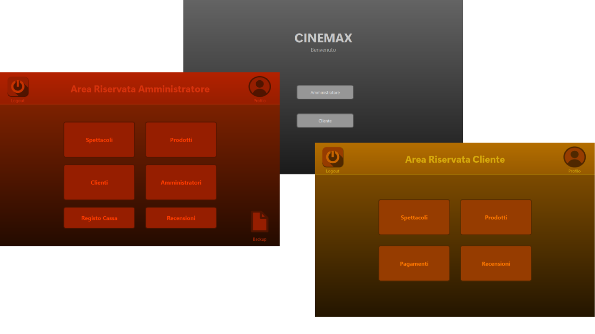

# CineMax

Il progetto consiste nella realizzazione di un software riguardante un cinema, dove si ha la possibilità di accedervi come amministratore o come cliente. Entrambi gli utenti sono dotati di un account e di una propria area riservata, in cui possono visualizzare, modificare o eventualmente eliminare il proprio profilo personale. Oltre a questo, gli utenti a seconda se sono amministratori o clienti, hanno la possibilità di svolgere determinate azioni.
  
  
<p align="center"></p>
  
Accedendovi come amministratore, si ha la possibilità di visualizzare, inserire, modificare o eliminare spettacoli e prodotti. Si ha anche la possibilità di visualizzare i pagamenti e le recensioni effettuate dai clienti. Si può visualizzare profili dei clienti e di amministratori. Come ultima cosa si ha anche la possibilità di effettuare il backup dei dati del sistema.
  
  
<p align="center"></p>
  

Accedendovi come cliente, si ha la possibilità di visualizzare spettacoli e prodotti ed eventualmente acquistare uno di essi con la possibilità di utilizzare come metodo di pagamento un sistema di punti accumulabili facendo acquisti utilizzando il metodo di pagamento normale. Si può visualizzare i pagamenti effettuati e si può visualizzare, inserire, modificare o eliminare le proprie recensioni.
  
  
<p align="center"></p>
  
## Installazione

Per poter utilizzare questo software, avete bisogno di `Python 3.11.5` (o superiore) con il pacchetto `dnspython` e la libreria grafica `PySide6` installati.
Qua sotto c'è il link del sito ufficiale per scaricare `python 3.11.5` e ci sono anche i comandi per l'installazione dei pacchetti da eseguire nel `Command Prompt di Windows`.

https://www.python.org/downloads/

```bash
pip install dnspython
pip install PySide6
```
Successivamente se volete avviare immediatamente il programma senza configurare il suo avvio, dovete utilizzare l'ambiente di sviluppo `Visual Studio Code` e al suo interno scaricare l'estensione di `Python` che trovate nella barra laterale a sinistra nella sezione `Extensions`. Sempre sotto trovate il link per il download.

https://code.visualstudio.com/
  
  
  <p align="center"></p>
  

Ora bisogna scaricate la repository da `GitHub web` oppure da `cmd` con il seguente comendo:

```bash
git clone https://github.com/GiacomoPrincipi/CineMax
```
<p align="center"></p>
  


Successivamente bisogna aprire la cartella su `VS Code` andando dal menù in alto su:
```
File > Open Folder
```
oppure premendo il comando `Ctrl+K Ctrl+O`
  
  
<p align="center"></p>
  

 Infine bisogna andare sulla barra laterale, premere `Run and Debug` e premere `Run` oppure premere direttamente `Ctrl+F5`. Avete anche la possibilità di avviare i test premento il menù a tendina.
   
   
<p align="center"></p>
  
  
 Per accedere come cliente basta registrarsi, invece se volete provare ad accedere come amministratore, all' interno sono già memorizzate delle credenziali che sono:
 ```
 Email: paolorossi@gmail.com
 Password: PaoloRossi00@#
 ```
 Ora è tutto pronto, potete iniziare a testare il software. Grazie per la collaborazione.